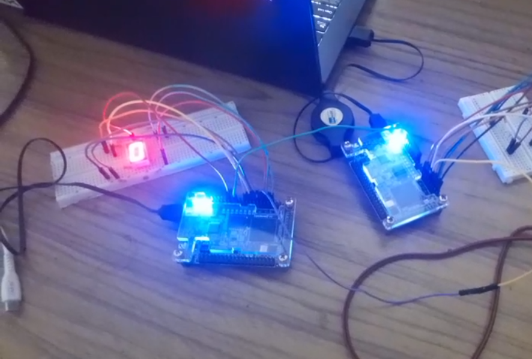

# ⚡ FPGA-based-Transceiver

A comprehensive **FPGA UART transceiver** implementation 🖥️🔌 — including transmitter, receiver, test benches, and simulation setup. Written in **Verilog** & **VHDL** 💻.

<div align="center">
 


</div>
---

## 📖 Overview

This repo contains an FPGA-based transceiver project featuring:

* 📡 **UART Transceiver Modules** – TX & RX implementations in Verilog/VHDL
* 🔢 **Binary-to-7-Segment Display** – for real-time output visualization
* 🧪 **Test Benches** – loopback & inversion tests included
* 🛠️ **FPGA Project Files** – Quartus project setup (`.qpf`, `.qsf`, `.qws`)
* 📊 **Simulation Artifacts** – ModelSim reports & waveforms
* 🗂️ **Organized Workflow** – source files, simulations, output builds

---

## 📂 Repository Structure

```text
/FPGA-based-Transceiver
├── README.md
├── UART_test.qpf            # 🛠️ Quartus Project File
├── UART_test.qsf            # ⚙️ Quartus Settings File
├── UART_test.qws            # 📂 Quartus Workspace File
├── binary_to_7seg.v         # 🔢 7-Segment Display module
├── uart_tx.v                # 📤 UART Transmitter
├── uart_rx.v                # 📥 UART Receiver
├── uart_transceiver.v       # 🔄 Full Transceiver
├── uart_loopback_test.v     # 🔁 Loopback Test
├── invert_uart_transceiver_test.v # 🔀 Inversion Test
├── uart_tb.vhd              # 🧪 Testbench (VHDL)
├── uart_transceiver_test.v  # 🧪 Testbench (Verilog)
├── uart_transceiver_test_tb.v # 🧪 Testbench Top
├── simulation/modelsim/     # 🧰 Simulation setup
├── work/                    # 🗂️ Build files
└── output_files/            # 📦 Synthesized outputs
```

---

## ✨ Features

✅ Supports **Verilog & VHDL**
✅ Implements **UART TX/RX** communication
✅ Modular design 🧩 (easy to expand)
✅ Ready for **simulation (ModelSim)** & **synthesis (Quartus)**
✅ Includes **loopback** 🔁 & **inversion** 🔀 testing

---

## 🚀 Getting Started

### 🔧 Prerequisites

* 🏗️ **Intel Quartus Prime** (FPGA synthesis & programming)
* 🎛️ **ModelSim** (simulation & waveform analysis)
* 📘 Basic knowledge of Verilog/VHDL & UART

---

## 🧪 Simulation Workflow

1. Open `simulation/modelsim/` in **ModelSim**.
2. Compile design + test benches (`uart_loopback_test.v`, `invert_uart_transceiver_test.v`).
3. Run simulation ▶️.
4. Inspect **waveforms** 📈 & confirm correct UART behavior.

---

## 🔨 FPGA Synthesis & Programming

1. Open **Quartus Project** → `UART_test.qpf`.
2. Configure **FPGA device** & **pin assignments** 📍.
3. Compile & synthesize 🏗️.
4. Generate `.sof` file & program FPGA 🔌.
5. Connect to **7-segment display** 🔢 (optional).

---

## 🧑‍💻 Usage Examples

* 🔁 **Loopback Test** – Verify TX → RX data integrity.
* 🔀 **Inversion Test** – Validate inverted UART stream.
* 🔧 Extend with **custom UART features** or **peripherals**.

---

